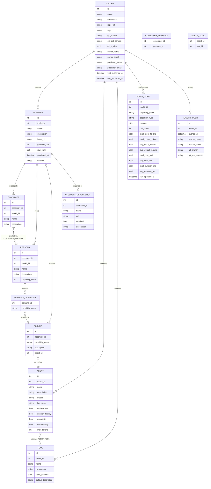

# AI Catalog — Domain Diagram

The catalog stores published snapshots of AI toolkits. Each push replaces the structural data (assemblies, agents, tools) and accumulates usage statistics. Ownership and push attribution are tracked separately from the mutable toolkit record.

---

## Implementation status

| Entity / relationship | In DB schema | Extractor populates |
|---|---|---|
| TOOLKIT | ✓ | ✓ |
| ASSEMBLY | ✓ (no `version`, no `base_url`) | ✓ (port lookup broken for ref-impl pattern) |
| ASSEMBLY_DEPENDENCY | ✗ | ✗ |
| BINDING | ✗ | ✗ (data is in YAML `bindings[].{capability_name, description, agent_id}`) |
| CONSUMER | ✓ | ✓ |
| PERSONA | ✓ (count only, no capability names) | ✓ (count only) |
| CONSUMER_PERSONA | ✗ | ✗ (data is in YAML `consumers[].personas[]`) |
| PERSONA_CAPABILITY | ✗ | ✗ (data is in YAML `personas[].capabilities[]`) |
| AGENT | ✓ (missing `orchestrator`, `session_history`, `guardrails`, `observability`, `max_tokens`) | ✓ (description from binding, not agents.yaml) |
| TOOL | ✓ (`input_schema` column exists but always NULL) | ✓ (input_schema never read) |
| AGENT_TOOL | column `tools_used` exists as JSON on AGENT | ✗ (extractor always sends `[]`) |
| TOKEN_STATS | ✓ | ✓ |
| TOOLKIT_PUSH | ✓ | ✓ |

---

## Key design decisions

| Decision | Rationale |
|---|---|
| Assembly/agent/tools replaced on each push | Latest snapshot always wins; structural drift is corrected automatically |
| `token_stats` accumulated, never replaced | Call counts and costs grow monotonically; each developer's pushes contribute additive increments |
| `TOOLKIT_PUSH` is append-only | Full contributor history retained regardless of toolkit structural changes |
| Ownership separate from publisher | First pusher becomes owner; subsequent pushers update `publisher_*` only, not `owner_*` (unless `claim_ownership: true`) |
| `AGENT → TOOL` is a name reference, not a FK | `tools_used` is a JSON array of names; tools are resolved at read time within the same toolkit |
| Tags stored as comma-separated string | No separate tag table in v1 — acceptable for the current scale |
